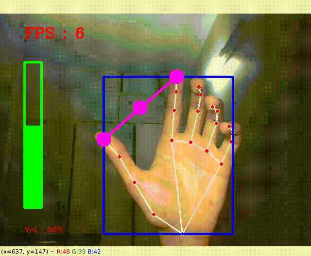

## By Hand  

This is a little project to make your laptop more intractive . It uses mediapipe hand solutions to detect hand landmarks and uses  that data to change volumn or move the mouse. 

## Getting Started 
The project is on Volumn by deafault. In order to change that you will only need to uncomment related lines in main.py. 
# Volumn 
VolumnController uses HandTrackingModule to find the distance between index and thumb. It then uses set_volumn method to change the volumn. However This method only works on Linux. Refer to Acknowledgments for help.

     

# Mouse 
There are two modes. moving and clicking. When There's only index up MouseController enters moving mode. It creates a Rectangle for us to move our finger in and calculates relative coordinates to move the mouse. If both middle and index are up, We are in clicking mode. It waits until index and middle tips touch then clicks. 

     

### Prerequisites 

* [mediapipe](https://github.com/google/mediapipe)
* [opencv](https://github.com/opencv/opencv)
* [autopy](https://github.com/autopilot-rs/autopy)

## Contribution 
This project was created for educational purposes, hence there isn't much to it. However if you had ideas, Feel free to contribute.  

## Acknowledgments
This was inspired by Murtaza's workshop. I'm using his HandTrackingModule which can be found [here](https://www.computervision.zone/courses/gesture-volume-control/).  You can follow Murtaza on Youtube and Github. 